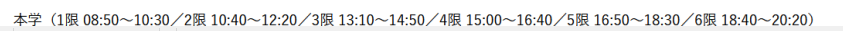

# CodeWidget

**[English]** | [日本語](docs/README_ja.md)

A lightweight desktop tool for university teachers who use an LMS such as UNIPA
to manage class attendance codes — no manual operation needed during the lesson.

## Overview

CodeWidget shows a floating overlay window on your desktop during class time,
displaying a randomized 4-digit attendance code that students enter into the
learning management system (LMS) to record their presence.

The overlay appears automatically at the start of each scheduled class and
disappears after class ends — no manual operation required during the lesson.



## Features

- **Automatic schedule tracking** — reads your course timetable and shows the
  correct code at the right time, including makeup and rescheduled sessions
- **Per-session codes** — each class meeting has its own pre-assigned code;
  codes can be edited or bulk-generated at any time
- **Floating overlay** — compact, always-on-top window; position is remembered
  across restarts
- **Config dialog** — full GUI to manage courses, preview the semester schedule,
  add date adjustments, and customize appearance
- **Multiple teacher configs** — each teacher keeps a separate JSON file;
  switching is one click
- **Appearance customization** — font, colors, and window scale stored globally
  in `settings.json`, independent of teacher data

## Requirements

- Windows 10 / 11
- macOS 12 Monterey or later

## Getting Started

**Windows**

1. Download `CodeWidget.exe` from [Releases](../../releases)
2. Place it in any folder — a `config/` subdirectory is created automatically
   on first launch
3. Open the settings dialog (tray icon → **Settings**) and configure your courses

**macOS**

1. Download `CodeWidget.dmg` from [Releases](../../releases)
2. Open the `.dmg` and drag **CodeWidget.app** to your Applications folder
3. Launch the app — a `config/` subdirectory is created in
   `~/Library/Application Support/CodeWidget/` on first run
4. Open the settings dialog (tray icon → **Settings**) and configure your courses

## Configuration Files

| File | Purpose |
|------|---------|
| `config/settings.json` | Global appearance settings and active teacher config path |
| `config/teacher_config.json` | Default blank teacher template |
| `config/school_config.json` | School calendar: semester dates, holidays, period times |

All files are plain JSON and can be edited by hand or replaced each academic year.

## Building from Source

### Windows EXE

This project's development environment is Docker (Linux) sharing the working
directory with the host Windows machine. A separate `.venv-win` virtual
environment is used for bundling to avoid overwriting the Docker `.venv`.

Run the following in Windows PowerShell from the project directory:

```powershell
$env:UV_PROJECT_ENVIRONMENT = ".venv-win"
uv sync --dev
uv run pyinstaller CodeWidget.spec --clean
# Output: dist/CodeWidget.exe
```

> `$env:UV_PROJECT_ENVIRONMENT` is session-scoped and does not affect other
> projects or the Docker environment.

### macOS DMG

Run on a Mac (Xcode Command Line Tools required):

```bash
# Prerequisites: Python 3.12, uv
uv sync --dev
uv run pyinstaller CodeWidget.spec --clean
# Output: dist/CodeWidget.app
# Package into DMG with your preferred tool (e.g. create-dmg)
```

### Running Tests

```bash
uv run pytest -v
```

## License

[MIT](LICENSE)

> This software uses [PySide6](https://doc.qt.io/qtforpython/), licensed under
> [LGPL v3](https://www.gnu.org/licenses/lgpl-3.0.html).
> See [NOTICE](NOTICE) for full attribution.
