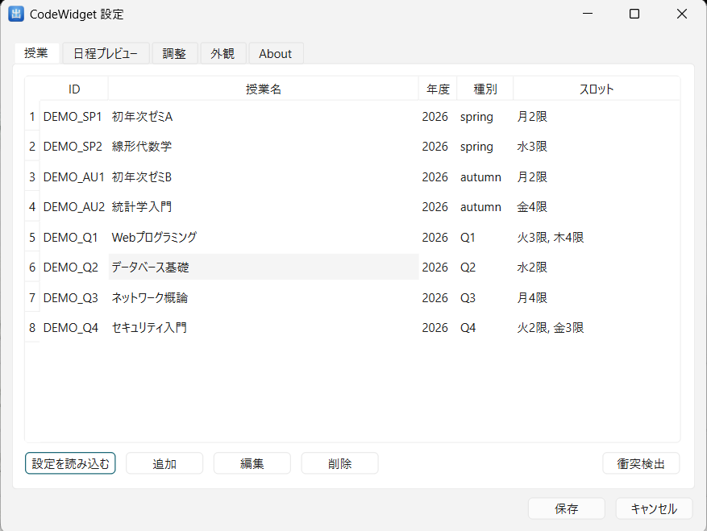
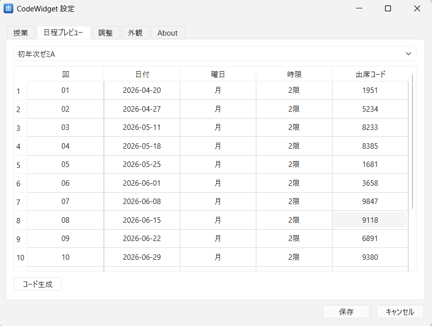
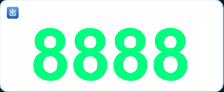
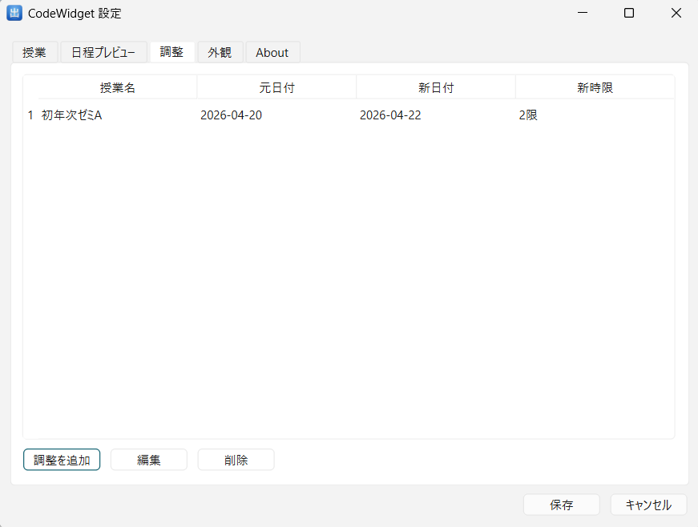
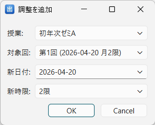
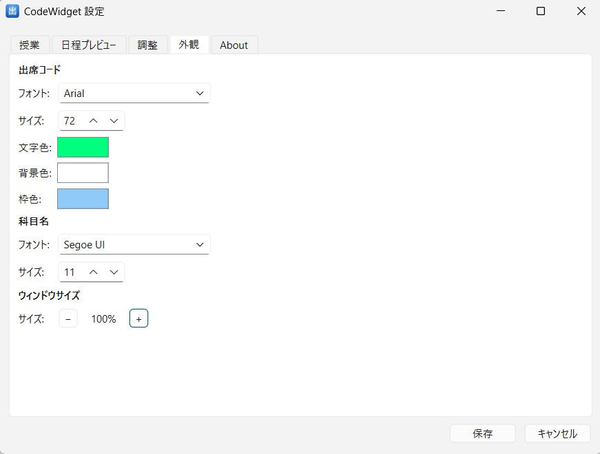

# CodeWidget ユーザーマニュアル

**バージョン**：1.0  
**日付**：2026-08-08  
**対応OS**：Windows 10 / 11

---

## 目次

1. [はじめに](#1-はじめに)
2. [初期設定](#2-初期設定)
3. [日常利用](#3-日常利用)
4. [授業スケジュールの管理](#4-授業スケジュールの管理)
5. [外観のカスタマイズ](#5-外観のカスタマイズ)
6. [トラブルシューティング](#6-トラブルシューティング)

---

## 1. はじめに

### 1.1 機能概要

CodeWidget は大学教員向けのデスクトップツールです。授業開始前に自動的にフローティングウィンドウを表示し、その授業の出席コードを提示します。授業終了後は自動的に非表示になり、授業中に手動操作は不要です。

主な機能：

- 学校カレンダーに基づいて授業時間を自動計算し、時間になると出席コードを表示
- 各授業回に出席コードを事前割り当て。一括生成または手動入力に対応
- 休講・補講・振替などの特殊スケジュールに対応
- フローティングウィンドウは常に最前面に表示。位置はドラッグで移動でき、再起動後も記憶
- システムトレイアイコンで操作。タスクバーには表示されない

### 1.2 動作環境

- **OS**：Windows 10 / 11
- **インストール**：単体 `.exe` ファイル。インストーラー不要
- **依存関係**：なし（すべて内包済み）

---

## 2. 初期設定

### 2.1 ファイルの配置

`CodeWidget.exe` を任意のフォルダーに置いてください。初回起動時に、同フォルダー内に `config/` フォルダーが自動作成されます。

| ファイル | 用途 |
|---------|------|
| `config/school_config.json` | 学校カレンダー（学期期間・時限・祝日） |
| `config/teacher_config.json` | 教員データ（授業・出席コード・調整記録） |
| `config/settings.json` | 外観設定（フォント・色・ウィンドウサイズ） |

> すべての設定ファイルはプレーンテキストの JSON 形式です。メモ帳で直接編集することもできます。

### 2.2 学校カレンダーの確認（school_config.json）

`school_config.json` には学校の標準カレンダー（学期開始・終了日、各時限の時間、祝日）があらかじめ設定されています。新年度に変更が必要な場合は、このファイルを差し替えるだけで対応できます。

各時限のデフォルト時間：

| 時限 | 開始 | 終了 |
|------|------|------|
| 1限 | 08:50 | 10:30 |
| 2限 | 10:40 | 12:20 |
| 3限 | 13:10 | 14:50 |
| 4限 | 15:00 | 16:40 |
| 5限 | 16:50 | 18:30 |
| 6限 | 18:40 | 20:20 |

### 2.3 授業の登録（設定ダイアログ）

トレイアイコンをダブルクリック、またはトレイアイコンを右クリックして **設定…** を選択すると設定ダイアログが開きます。

**授業** タブでは、登録済みの授業一覧を確認・管理できます。

操作手順：

1. **追加** をクリックして新しい授業を作成
2. 授業名・授業種別（spring / autumn / Q1〜Q4）・曜日・時限を入力
3. **保存** をクリック

> **設定を読み込む**：他の教員の設定ファイルを読み込めます。複数の教員で1台のPCを共用する場合に便利です。

登録後、**日程プレビュー** タブに切り替えて学期全体の日程を確認し、日付が正しいことを確かめてください。

### 2.4 出席コードの設定

**日程プレビュー** タブでは、各授業回の出席コードを確認・編集できます。

- **手動入力**：入力欄をクリックして4桁の数字を直接入力
- **一括生成**：**コード生成** ボタンをクリックすると、未設定の全授業回にランダムなコードを自動生成

入力完了後 **保存** をクリックすると、出席コードが設定ファイルに書き込まれます。

---

## 3. 日常利用

### 3.1 起動と終了

**起動**：`CodeWidget.exe` をダブルクリックします。起動後はシステムトレイにアイコンが表示されます。タスクバーには表示されません。

**終了**：トレイアイコンを右クリック → **終了** を選択します。

> プログラムはバックグラウンドで動作し続けるため、毎回の授業前に手動操作は不要です。

### 3.2 出席コードウィンドウの見方

授業時間ウィンドウ内（デフォルト：授業開始10分前〜開始後30分）に、出席コードのフローティングウィンドウが自動で表示されます。

ウィンドウ中央に4桁の出席コードが大きく表示されます。学生はこのコードを学習管理システムに入力して出席を記録します。

ウィンドウの特性：
- 常に最前面に表示され、他のウィンドウに隠れません
- マウスでドラッグして任意の位置に移動でき、再起動後も位置を記憶します
- 授業時間ウィンドウが終了すると自動的に非表示になります

### 3.3 一時コードの入力・クリア

設定ファイルを変更せずに、一時的に別のコードを表示できます。

1. フローティングウィンドウを右クリック → **入力** を選択
2. ウィンドウ内に直接新しい出席コードを入力し、Enter キーで確定
3. 一時コードの有効期限は **30分** です。期限を過ぎると自動的に正式な出席コードに戻ります

**一時コードのクリア**：フローティングウィンドウを右クリック → **クリア** を選択すると、即座に正式な出席コードに戻ります。

> 一時コードはメモリ上のみに保存されます。プログラムを再起動すると消去されます。

### 3.4 ウィンドウの表示・非表示

| 操作 | 方法 |
|------|------|
| ウィンドウを隠す | フローティングウィンドウを右クリック → **隠す**、またはトレイアイコンを右クリック → **ウィンドウを隠す** |
| ウィンドウを再表示 | トレイアイコンを右クリック → **ウィンドウを表示**、またはトレイアイコンをシングルクリック |

> 手動で非表示にした後、次の授業開始時にウィンドウは自動的に再表示されません。プログラムを再起動するか、手動で表示操作を行ってください。

---

## 4. 授業スケジュールの管理

**設定** → **調整** タブでは、休講・補講・振替の記録を管理できます。

### 4.1 休講の登録

1. **調整を追加** をクリック
2. 授業を選択し、調整種別で **休講** を選択
3. 休講日を選択して **OK**

該当日の授業回が日程から削除され、以降の授業回の番号が自動的に振り直されます。

### 4.2 補講の登録

1. **調整を追加** をクリック
2. 授業を選択し、調整種別で **補講** を選択
3. 補講日と時限を選択して **OK**

補講日が追加の授業回として日程の末尾に加わります。

### 4.3 振替の登録

授業回を別の日時に移動します。

1. **調整を追加** をクリック
2. 授業を選択し、調整種別で **振替** を選択

3. **対象回** で移動元の授業回を選択
4. **新日付** と **新時限** を設定
5. **OK** をクリック

元の日時から授業回が削除され、新しい日時に再配置されます。出席コードの対応関係は維持されます。

### 4.4 調整の編集・削除

- 一覧から調整レコードを選択し **編集** をクリックすると変更できます（振替タイプのみ対応）
- **削除** をクリックすると選択した調整が取り消されます

### 4.5 日程プレビューの確認

すべての調整が完了したら、**日程プレビュー** タブで最終的な日程を確認してください。日付・時限・出席コードが意図通りであることを確かめてから **保存** をクリックします。

---

## 5. 外観のカスタマイズ

**設定** → **外観** タブでは、出席コードウィンドウのビジュアルスタイルを変更できます。

| 設定項目 | 説明 |
|---------|------|
| 出席コード — フォント | 出席コードのフォント族 |
| 出席コード — サイズ | 出席コードのフォントサイズ |
| 文字色 | 数字の色（カラーブロックをクリックして選択） |
| 背景色 | ウィンドウの背景色 |
| 枠色 | 角丸枠線の色 |
| 科目名 — フォント | 授業名の表示フォント |
| 科目名 — サイズ | 授業名のフォントサイズ |
| ウィンドウサイズ | 全体の拡大率（**＋** / **−** で10%ずつ調整） |

変更後に **保存** をクリックすると、フローティングウィンドウに即座に反映されます。

---

## 6. トラブルシューティング

### 6.1 ウィンドウが表示されない

**症状**：授業時間中なのに出席コードウィンドウが表示されない。

**原因と対処法**：

| 原因 | 対処法 |
|------|--------|
| 授業が正しく登録されていない | 設定ダイアログの日程プレビューで該当日に授業があるか確認 |
| 表示時間ウィンドウが狭すぎる | 授業タブで「開始前表示」（デフォルト10分）と「終了後表示」（デフォルト30分）を確認・調整 |
| スリープからの復帰直後 | 復帰後30秒以内に自動更新されます。それでも表示されない場合はトレイアイコンをシングルクリックしてください |
| 手動で非表示にしていた | トレイアイコンを右クリック → **ウィンドウを表示** |

### 6.2 コードが更新されない

**症状**：設定を保存したのに、フローティングウィンドウが古い出席コードのまま。

**対処法**：

1. 設定ダイアログの **保存** ボタンを押したか確認してください
2. 保存後、数秒以内にウィンドウが自動更新されます。更新されない場合はプログラムを再起動してください

### 6.3 ウィンドウが画面外に消えた

**症状**：外付けモニターを取り外した後、出席コードウィンドウが見えなくなり、ドラッグして戻せない。

**対処法**：

プログラムを再起動してください。起動時にウィンドウの位置を自動チェックし、保存された位置が現在の画面範囲外にある場合、メインスクリーンの左上に自動的にリセットされます。

### 6.4 バージョン更新後にトレイアイコンが表示されない

**症状**：`CodeWidget.exe` を新しいバージョンに差し替えた後、通知領域にアイコンが表示されない。

**対処法**：

Windows はトレイアイコンの表示設定を実行ファイルのパスで管理しています。新しい `.exe` を**同じフォルダー・同じファイル名**で上書きする限り、設定は引き継がれます。

パスが変わった場合は、Windows の設定から再度有効化してください：
> 設定 → 個人用設定 → タスクバー → その他のシステム トレイ アイコン → CodeWidget をオン

---

*ご不明な点はシステム管理者にお問い合わせください。*
